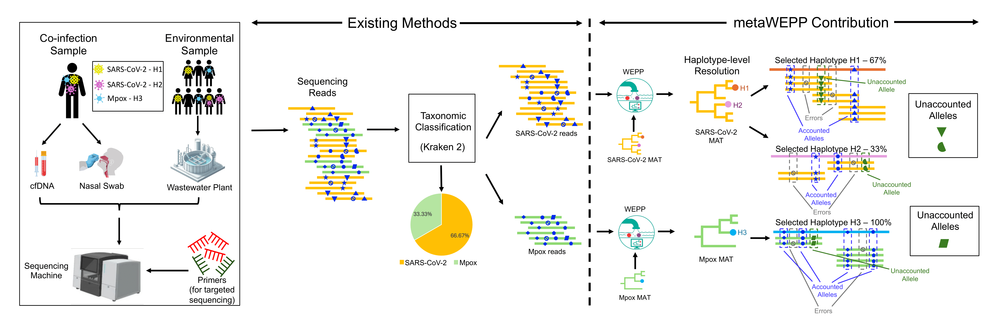

<div align="center">

# metaWEPP: Improving resolution of metagenomic analysis using WEPP

[license-badge]: https://img.shields.io/badge/License-MIT-yellow.svg 
[license-link]: https://github.com/TurakhiaLab/WEPP/blob/main/LICENSE

[![License][license-badge]][license-link]
[](https://cmake.org)
[](https://snakemake.readthedocs.io/en/v7.19.1/index.html)

<div align="center">
  
</div>

</div>

## Table of Contents
- [Introduction](#intro)
- [Installation](#install)
  - [Option-1: Install via Dockerfile](#docker)
  - [Option-2: Install via Shell Commands (requires sudo access)](#shell)
- [Quick Start](#example)
  - [Example-1: Simulated metagenomic sample](#simulate)
  - [Example-2: Real world metagenomic sample](#real-world) 
- [User Guide](#guide)
  - [Data Organization](#data)
  - [metaWEPP Arguments](#arg)
    - [Example of species-specific arguments](#argexample)
  - [Run Command](#run) 
  - [MAT for pathogen species](#mat) 
- [Kraken2 Database](#build-database)
  - [Downloading prebuilt database](#prebuilt)
  - [Creating custom database](#custom)

<br>


## <a name="intro"></a> Introduction

metaWEPP is a Snakemake-based bioinformatics pipeline that achieves near-haplotype resolution in metagenomic analysis. As illustrated in the figure, metaWEPP can analyze metagenomic or mixed-genome samples from environmental sources and clinical specimens. metaWEPP first uses standard taxonomic classifiers to assign sequencing reads to known species, then applies [WEPP](https://github.com/TurakhiaLab/WEPP) to phylogenetically place these reads onto updated, species-specific mutation-annotated trees built from all publicly available clinical sequences,  and finally selects the subset of haplotypes that best explains the sample. It also reports unaccounted alleles that are indicative of novel variants and includes an interactive dashboard to provide a detailed read-level visualization for each species. 

<div align="center">
    
    <div><b>Figure 1: metaWEPP Overview</b></div>
</div>


## <a name="install"></a> Installation
⚠️ Currently, if you do not have a MAT for a pathogen and want to generate one using viral_usher while running metaWEPP in a Docker container, you must run viral_usher outside the metaWEPP container and then copy the resulting MAT into the container.

### <a name="docker"></a> Option-1: Install via Dockerfile.

**Step 1:** Clone the metaWEPP repository.
```
git clone https://github.com/TurakhiaLab/metaWEPP.git
cd metaWEPP
```

**Step 2:** Build a Docker Image.
```
cd docker
docker build -t metawepp . 
cd ..
```
**Step 3:** Start and run Docker container. The command below will take you inside the Docker container with metaWEPP already installed. 
```
# -p <host_port>:<container_port> → Maps container port to a port on your host (Accessing Dashboard, NOT needed otherwise)
# Replace <host_port> with your desired local port (e.g., 100 or 8080)
docker run -it -p 80:80 metawepp
```

All set to try the [examples](#example).


### <a name="shell"></a> Option-2: Install via Shell Commands (requires sudo access).

**Step 1:** Clone the repository.
```
git clone https://github.com/TurakhiaLab/metaWEPP.git
cd metaWEPP
```

**Step 2:** Install Kraken.
The following commands install kraken and also update the `$PATH` variable for running the tool easily.
```
git clone https://github.com/DerrickWood/kraken2.git
cd kraken2
./install_kraken2.sh .
echo -e "\nexport PATH=\"$(pwd):\$PATH\"" >> ~/.bashrc
source ~/.bashrc
cd ..
```

**Step 4:** Install `Minimap2`, `viral_usher`, `matplotlib`, and `snakemake`.

```
sudo apt-get install minimap2
pip install viral_usher matplotlib snakemake
```
**Step 4:** Install `WEPP`.

```
git clone --recurse-submodules https://github.com/TurakhiaLab/WEPP.git
```
View the WEPP installation guide starting from Option 3 in the [WEPP repository](https://github.com/TurakhiaLab/WEPP/tree/main?tab=readme-ov-file#-option-3-install-via-shell-commands-requires-sudo-access).

All set to try the [examples](#example).


##  <a name="example"></a> Quick Start

### <a name="simulate"></a> Example - 1: Simulated metagenomic sample 
**Step 1:** Download the MAT for SARS-CoV-2 and RSV-A.
```
wget https://hgdownload.gi.ucsc.edu/goldenPath/wuhCor1/UShER_SARS-CoV-2/2023/04/01/public-2023-04-01.all.masked.pb.gz
wget https://hgdownload.gi.ucsc.edu/hubs/GCF/002/815/475/GCF_002815475.1/UShER_RSV-A/2025/04/25/rsvA.2025-04-25.pb.gz
```

**Step 2:** Download Viral Kraken2 database.
```
wget https://genome-idx.s3.amazonaws.com/kraken/k2_viral_20251015.tar.gz
mkdir -p viral_kraken_db
tar -xvzf k2_viral_20251015.tar.gz -C viral_kraken_db
rm k2_viral_20251015.tar.gz
```

**Step 3:** Run the pipeline

Follow the command prompts to add the pathogens.

```
snakemake --config KRAKEN_DB=viral_kraken_db DIR=simulated_metagenomic_sample MIN_PROP=0.05 PATHOGENS=default,respiratory_syncytial_virus_a,sars_cov_2 CLADE_LIST=,nextstrain,nextstrain:pango CLADE_IDX=-1,0,1 --cores 32
```

For SARS-CoV-2:
```txt
a) Type "sars cov 2" as the virus of interest.
b) Select "Severe acute respiratory syndrome coronavirus 2" by pressing "1" and pressing Enter.
c) Select "NC_045512.2" by pressing "1" and pressing Enter.
d) Provide the MAT file path: "./public-2023-04-01.all.masked.pb.gz".
```

RSV-A:
```txt
a) Type "respiratory syncytial virus a" as the virus of interest.
b) Select "human respiratory syncytial virus" by pressing "2" and pressing Enter.
c) Select "NC_038235.1" by pressing "2" and pressing Enter.
d) Provide the MAT file path: "./rsvA.2025-04-25.pb.gz".
```

**Step 5:**  Analyze Results.

Species proportions can be viewed in `results/simulated_metagenomic_sample/classification_proportions.png`, which shows the following proportions:
```txt
- 66.33%  Severe acute respiratory syndrome coronavirus 2
- 31.38%  Human respiratory syncytial virus A
- 1.94%   human respiratory syncytial virus
```

Haplotype-level results generated by WEPP for SARS-CoV-2 and RSV-A are available in `WEPP/results/simulated_metagenomic_sample_sars_cov_2/metaWEPP_run_haplotype_abundance.csv` and `WEPP/results/simulated_metagenomic_sample_respiratory_syncytial_virus_a/metaWEPP_run_haplotype_abundance.csv`, respectively.


SARS-CoV-2 Haplotype abundances
```txt
node_701971,B.1.1.186,0.500000
node_1159601,XBB.1.5,0.500000
```

RSV-A Haplotype abundances
```txt
Argentina/BA-HNRG-369/2017|ON237340.1|2017-06-26,A.D.2.2,0.500000
USA/MA-Broad_MGB-13815/2022|OQ171906.1|2022-07-27,A.D.1.5,0.500000
```

### <a name="real-world"></a> Example - 2: Real world metagenomic sample
**Step 1:** Download the real world metagenomic sample.
```
mkdir -p data/real_metagenomic_sample
cd data/real_metagenomic_sample
wget ftp://ftp.sra.ebi.ac.uk/vol1/fastq/ERR108/074/ERR10812874/ERR10812874_1.fastq.gz ftp://ftp.sra.ebi.ac.uk/vol1/fastq/ERR108/074/ERR10812874/ERR10812874_2.fastq.gz
mv ERR10812874_1.fastq.gz ERR10812874_R1.fastq.gz
mv ERR10812874_2.fastq.gz ERR10812874_R2.fastq.gz
cd ../../
```

**Step 2:** Download the RSV-A MAT.
```
wget https://hgdownload.gi.ucsc.edu/hubs/GCF/002/815/475/GCF_002815475.1/UShER_RSV-A/2025/04/25/rsvA.2025-04-25.pb.gz
```

**Step 3:** Create the Rhinovirus-A MAT with viral_usher. Make sure you are not inside metaWEPP's docker container [Only for this step]. 
```
a) pip install viral_usher
b) viral_usher init
c) Type "rhinovirus a" as the virus of interest.
d) Select "Rhinovirus A" by pressing "1" and pressing Enter.
e) Select "NC_001617.1" by pressing "2" and pressing Enter.
f) Type "0.1" for minimum length proportion of the RefSeq length and press Enter.
g) Type "0.5" for maximum 'N' proportion and press Enter.
h) Use default values for maxmimum private and branch substitutions by pressing Enter.
i) Press Enter when it asks for more fasta files, and metadata files.
j) Give "./rhinovirus_a_MAT" as the directory for building MAT and press Enter.
k) Run "viral_usher build --config ./rhinovirus_a_MAT/viral_usher_config_NC_001617.1_3428501.toml"
l) Copy the MAT inside the docker container: docker cp ./rhinovirus_a_MAT/viz.pb.gz <CONTAINER ID>:/metaWEPP/rhinovirus_a.pb.gz
```

**Step 5:** Download Viral Kraken2 database.
```
wget https://genome-idx.s3.amazonaws.com/kraken/k2_viral_20251015.tar.gz
mkdir -p viral_kraken_db
tar -xvzf k2_viral_20251015.tar.gz -C viral_kraken_db
rm k2_viral_20251015.tar.gz
```

**Step 6:** Run the pipeline 
```
snakemake --config KRAKEN_DB=viral_kraken_db DIR=real_metagenomic_sample MIN_PROP=0.05 PATHOGENS=default,respiratory_syncytial_virus_a CLADE_LIST=,nextstrain CLADE_IDX=-1,0 --cores 32
```

On being prompted to add a new species for haplotype-level analysis, press `y`, and follow the steps below for RSV-A and Rhinovirus-A.

RSV-A:
```txt
a) Type "respiratory syncytial virus a" as the virus of interest.
b) Select "Rhinovirus A" by pressing "1" and pressing Enter.
c) Select "NC_038235.1" by pressing "2" and pressing Enter.
d) Provide the MAT file path: "./rsvA.2025-04-25.pb.gz".
```

Rhinovirus-A:
```txt
a) Type "rhinovirus a" as the virus of interest.
b) Select "human respiratory syncytial virus" by pressing "2" and pressing Enter.
c) Select "NC_001617.1" by pressing "2" and pressing Enter.
d) Provide the MAT file path: "./rhinovirus_a.pb.gz".
```

**Step 7:**  Analyze Results.

Species proportions can be viewed in `results/real_metagenomic_sample/classification_proportions.png`, which shows the following proportions:
```txt
- 74.74%  Unclassified
- 12.95%  Human respiratory syncytial virus A
- 6.96%   Choristoneura fumiferana granulovirus
- 2.00%   Others
- 1.83%   Shamonda virus
- 1.53%   human respiratory syncytial virus
```

Haplotype-level results generated by WEPP for RSV-A and Rhinovirus-A are available in `WEPP/results/real_metagenomic_sample_respiratory_syncytial_virus_a/metaWEPP_run_haplotype_abundance.csv` and `WEPP/results/real_metagenomic_sample_rhinovirus_a/metaWEPP_run_haplotype_abundance.csv`, respectively.


RSV-A Haplotype abundances
```txt
node_1639,A.D.1,1.000000
```

Rhinovirus-A Haplotype abundances
```txt
HRVA/PUNE/NIV108127/10|KM109984.1|2010-01-26,,1.000000
```

## <a name="guide"></a> User Guide

### <a name="data"> Data Organization
We assume that all metagenomic samples are stored in the `data` directory, each within its own subdirectory given by DIR argument (see [Run Command](#run)). Pathogen species to be analyzed with WEPP at the haplotype level can be added either manually or automatically fetched by metaWEPP based on user inputs. For manual addition, create a directory for each species and place the reference genome fasta file and mat file at: 
```
data/pathogens_for_wepp/<pathogen_species_name>
```

Each created `DIR` inside `data` is expected to contain only the metagenomic sequencing reads, with filenames ending in `*_R{1/2}.fastq.gz` for paired-end reads, and `*.fastq.gz` for single-end reads. For each metagenomic sample, metaWEPP generates species-level results in the corresponding sample subdirectories under `results`. Haplotype-level results for each pathogen in a sample are located within the respective pathogen directories under `WEPP/results` as shown below. 

Visualization of metaWEPP's workflow directories
```
📁 metaWEPP
└───📁config
     ├───📁config.yaml                           # configuration for metaWEPP
└───📁data                                    
     ├───📁pathogens_for_wepp                    # [metaWEPP Generated/User Provided] Pathogens for haplotype analysis
          ├───📁RSV_A                   
               ├───RSV_A_ref_genome.fa     
               ├───RSV_A_mat.pb.gz
          ├───📁Tomato_Brown_Rugose_Fruit_Virus
               ├───Rugose_Virus_ref_genome.fa     
               ├───Rugose_Virus_mat.pb.gz
          ├───📁SARS_COV_2                
               ├───SARS_COV_2_ref_genome.fa     
               ├───SARS_COV_2_mat.pb.gz 

     ├───📁simulated_metagenomic_sample          # [User Provided] Contains metagenomic reads
          ├───sample_R1.fastq.gz      
          ├───sample_R2.fastq.gz
     ├───📁real_metagenomic_sample               # [User Provided] Contains metagenomic reads
          ├───sample_R1.fastq.gz      
          ├───sample_R2.fastq.gz


└───📁results                                    # [metaWEPP Generated] 
      ├───📁real_metagenomic_sample
           ├───📁Tomato_Brown_Rugose_Fruit_Virus
                ├───Tomato_Brown_Rugose_Fruit_Virus_R1.fastq.gz         
                ├───Tomato_Brown_Rugose_Fruit_Virus_R2.fastq.gz             
           ├───📁SARS_COV_2
                ├───SARS_COV_2_R1.fastq.gz    
                ├───SARS_COV_2_R2.fastq.gz
                
          ├───📁Other_Pathogens
                ├───📁Pathogen_1
                    ├───Pathogen_1_R1.fastq.gz         
                    ├───Pathogen_1_R2.fastq.gz

                ├───📁Pathogen_2
                    ├───Pathogen_2_R1.fastq.gz         
                    ├───Pathogen_2_R2.fastq.gz

      ├───📁simulated_metagenomic_sample                        
           ├───📁SARS_COV_2
                ├───SARS_COV_2_R1.fastq.gz    
                ├───SARS_COV_2_R2.fastq.gz
           ├───📁RSV_A
                ├───RSV_A_R1.fastq.gz         
                ├───RSV_A_R2.fastq.gz
     
└───📁WEPP                                    
      ├───📁results                              # [metaWEPP Generated]
           ├───📁Tomato_Brown_Rugose_Fruit_Virus_real_metagenomic_sample
                ├───file_1  
                ├───file_2
           ├───📁SARS_COV_2_real_metagenomic_sample
                ├───file_1  
                ├───file_2
           ├───📁SARS_COV_2_simulated_metagenomic_sample
                ├───file_1  
                ├───file_2
           ├───📁RSV_A_simulated_metagenomic_sample
                ├───file_1  
                ├───file_2
```

### <a name="arg"> metaWEPP Arguments

The metaWEPP Snakemake pipeline requires the following arguments, which can be provided either via the configuration file (`config/config.yaml`) or passed directly on the command line using the `--config` argument. The command line arguments take precedence over the config file.

1. `DIR` - Folder containing the metagenomic reads.
2. `KRAKEN_DB` - Folder containing the Kraken2 database. 
3. `SEQUENCING_TYPE` - Sequencing read type (s:Illumina single-ended, d:Illumina double-ended, or n:ONT long reads)
4. `PRIMER_BED` - BED file for primers, which should be present in the `WEPP/primers` directory.
5. `MIN_AF` - Alleles with an allele frequency below this threshold in the reads will be masked (Illumina: 0.5%, Ion Torrent: 1.5%, ONT: 2%) by WEPP.
6. `MIN_DEPTH` - Sites with read depth below this threshold will be masked by WEPP.
7. `MIN_Q` - Alleles with a Phred score below this threshold in the reads will be masked by WEPP.
8. `MIN_PROP` -  Minimum Proportion of haplotypes detected by WEPP (Wastewater Samples: 0.5%, Clinical Samples: 5%).
9. `MIN_LEN` -  Minimum read length to be considered after ivar trim (Default: 80).
10. `MAX_READS` - Maximum number of reads considered by WEPP from the sample. Helpful for reducing runtime.
11. `DASHBOARD_ENABLED` - Enables WEPP dashboard for visualization of haplotype results
12. `PATHOGENS` - List of pathogens with custom WEPP settings. Any species not listed here will use the `default` settings.
12. `CLADE_LIST` - Comma-separated list of clade annotation schemes present in the MAT file. Each element corresponds to the pathogen species in the order specified in `PATHOGENS`. If there is no clade annotation for a pathogen species, do not provide any value for that species.
13. `CLADE_IDX` - Comma-separated list of clade indices for each pathogen. If a pathogen has no lineage annotations, use **-1**. Each element corresponds to the pathogen species in the order specified by `PATHOGENS`.
14. `MIN_DEPTH_FOR_WEPP` - Minimum read coverage required to run WEPP for any pathogen species.
15. `MIN_PROP_FOR_WEPP` - Minimum relative abundance of a species before metaWEPP prompts to add it for haplotype-level analysis.


#### <a name="argexample"> Example of species-specific arguments:
```
PATHOGENS: "default,SARS_COV_2,RSV_A"
CLADE_LIST: ",nextstrain:pango,nextstrain"
CLADE_IDX: "-1,1,0"
```

These arguments are applied by first checking whether the species listed in `PATHOGENS` are present in `data/pathogens_for_wepp`. Then, the corresponding `CLADE_LIST` and `CLADE_IDX` values are used for WEPP analysis as follows:

**SARS_COV_2** - `CLADE_LIST` is **nextstrain,pango**, and `CLADE_IDX` is **1**. 
**RSV_A** - `CLADE_LIST` is **nextstrain** and `CLADE_IDX` is **0**.
**All other species** - `CLADE_LIST` is not passed, and `CLADE_IDX` is **-1**.


### <a name="run"> Run Command

metaWEPP requires `KRAKEN_DB` and `DIR` to be specified as command-line arguments. Other parameters can be provided via the config file. Additionally, the `--cores` argument must be supplied on the command line to specify the number of threads used by the workflow.

Examples:
1. Using all the parameters from the config file:
```
snakemake --config KRAKEN_DB=viral_kraken_db DIR=simulated_metagenomic_sample --cores 32
```

2. Overriding MIN_Q and MIN_PROP_FOR_WEPP through command line:
```
snakemake --config KRAKEN_DB=viral_kraken_db DIR=simulated_metagenomic_sample MIN_Q=25 MIN_PROP_FOR_WEPP=0.05 --cores 32
```

### <a name="mat"> MAT for pathogen species
Mutation-annotated trees (MATs) for some pathogen species are maintained by the UShER team and can be found [here](https://dev.usher.bio). Alternatively, metaWEPP includes an internal pipeline to generate MATs for any virus with sequences available on GenBank.


##  <a name="build-database"></a> Kraken2 Database
Users can either download prebuilt databases available online or create custom databases using their own genome sequences.

### <a name="prebuilt"> Downloading prebuilt database
**Step 1:** Get the link of `.tar.gz` file of the genome collection you want from [here](https://benlangmead.github.io/aws-indexes/k2). Download the database using either `wget` or `curl` command.


**Step 2:** Unzip the downloaded database in a new directory using `tar`.
```
mkdir -p <prebuilt_database>
tar -xvzf <database.tar.gz> -C <prebuilt_database>
```


### <a name="custom"> Creating custom database
**Step 1:** Download the taxonomy data, which is required to build a custom Kraken2 database. 
```
kraken2-build --download-taxonomy --db <custom_database>
```

**Step 2:** Add reference sequences to the database's genome library.
```
k2 add-to-library --file <reference_sequence.fa> --db <custom_database> 
```

**Step 3:** Build the custom database. 
```
kraken2-build --build --db <custom_database>
```

You can also customize kmer lengths with `--kmer-len` and `--minimizer-len`. For example,  
```
kraken2-build --build --db <custom_database> --kmer-len <kmer_length> --minimizer-len <minimizer_length>
```

More information about creating custom databases can be found [here](https://github.com/DerrickWood/kraken2/wiki/Manual#custom-databases).
