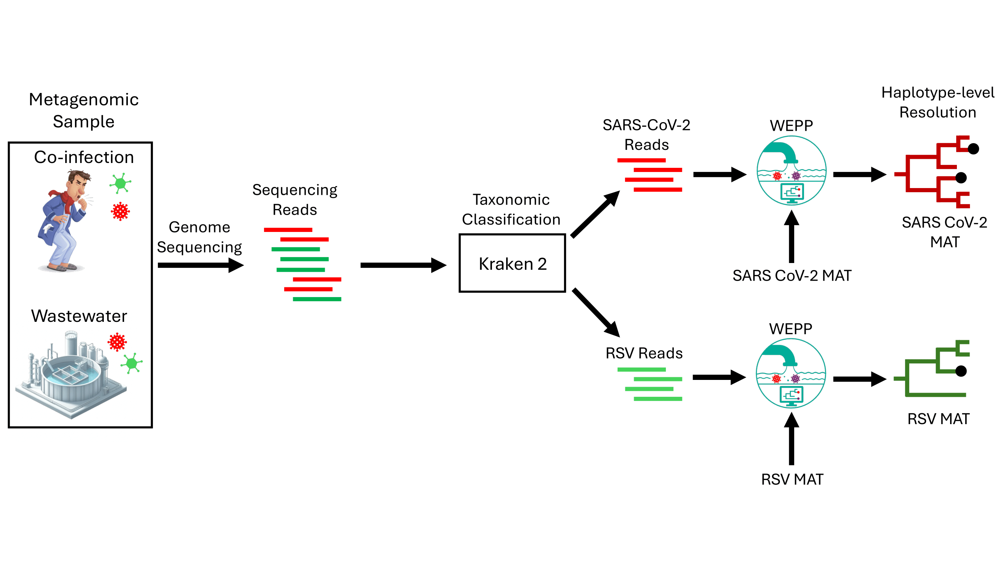

<div align="center">

# metaWEPP: Improving the resolution of metagenomic analysis using WEPP

[license-badge]: https://img.shields.io/badge/License-MIT-yellow.svg 
[license-link]: https://github.com/TurakhiaLab/WEPP/blob/main/LICENSE

[![License][license-badge]][license-link]
[](https://cmake.org)
[](https://snakemake.readthedocs.io/en/v7.19.1/index.html)

</div>

## Table of Contents
- [Introduction](#intro)
- [Installation](#install)
  - [Option-1: Install via Dockerfile](#docker)
  - [Option-2: Install via Shell Commands (requires sudo access)](#shell)
- [Quick Start](#example)
  - [Example-1: Single-Pathogen](#single)
  - [Example-2: Multi-Pathogen](#multi) 
- [User Guide](#guide)
  - [Data Organization](#data)
  - [Arguments](#arg)
  - [Run Command](#run) 
  - [MAT Download](#mat) 
- [Building Kraken Database](#build-database)
  - [Downloading prebuilt database](#prebuilt)
  - [Creating custom database](#custom)

<br>


## <a name="intro"></a> Introduction

metaWEPP is a Snakemake-based bioinformatics pipeline that enables haplotype-level resolution from metagenomic or mixed-genome samples. As illustrated in Figure 1, metaWEPP can analyze complex mixed-genome samples, such as environmental metagenomes or clinical specimens with co-infections. It leverages [Kraken2](https://github.com/DerrickWood/kraken2) for taxonomic classification, and then uses [WEPP](https://github.com/TurakhiaLab/WEPP) to determine haplotypes for each identified pathogen using a Mutation-Annotated Tree (MAT) built with [UShER](https://github.com/yatisht/usher) — a daily updated phylogeny of globally available clinical sequences and their inferred ancestors, enabling near-haplotype variant resolution in metagenomic samples. The pipeline also integrates WEPP’s interactive visualization dashboard, which allows in-depth exploration of detected haplotypes for each pathogen — offering fine-grained insights into metagenomic samples. 

<div align="center">
    
    <div><b>Figure 1: metaWEPP Overview</b></div>
</div>


## <a name="install"></a> Installation

### <a name="docker"></a> Option-1: Install via Dockerfile.

**Step 1:** Clone the repository.
```
git clone https://github.com/TurakhiaLab/metaWEPP.git
cd metaWEPP
```

**Step 2:** Build a Docker Image.
```
cd docker
docker build -t metawepp . 
cd ..
```
**Step 3:** Start and run Docker container. The command below will take you inside the Docker container with metaWEPP already installed. 
```
docker run -it metawepp
```


### <a name="shell"></a> Option-2: Install via Shell Commands (requires sudo access).

**Step 1:** Clone the repository.
```
git clone https://github.com/TurakhiaLab/metaWEPP.git
cd metaWEPP
```

**Step 2:** Install Kraken.
The following commands install kraken and also update the `$PATH` variable for running the tool easily.
```
git clone https://github.com/DerrickWood/kraken2.git
cd kraken2
./install_kraken2.sh .
echo -e "\nexport PATH=\"$(pwd):\$PATH\"" >> ~/.bashrc
source ~/.bashrc
cd ..
```
**Step 3:** Install WEPP.

```
git clone --recurse-submodules https://github.com/TurakhiaLab/WEPP.git
```
View the WEPP installation guide starting from option 3 on the [WEPP repo](https://github.com/TurakhiaLab/WEPP/tree/main?tab=readme-ov-file#-option-3-install-via-shell-commands-requires-sudo-access).

---

##  <a name="example"></a> Quick Start

### <a name="single"></a> Example - 1: Single-Pathogen -- RSV-A Metagenomic Sample

**Step 1:** Prepare the config.yaml and directory for RSV-A variant analysis.
```bash
cat <<EOF > config/config.yaml
PRIMER_BED: RSVA_all_primers_best_hits.bed
CLADE_IDX: -1
SEQUENCING_TYPE: d
PATHOGENS: rsv_a
CLADE_LIST: annotation_1
EOF
```
```bash
mkdir data/rsv_sample
```
**Step 2:**  Run the pipeline.
```
snakemake --config DIR=rsv_sample KRAKEN_DB=test_kraken_DB 
```
**Step 3:** Add RSV A.
Follow the command prompts.
```txt
a) Type "rsv" and press 'Enter' to search for RSV.
b) Select Human Respiratory Syncytial Virus by pressing the corresponding number, then 'Enter'.
c) Select Human Respiratory Syncytial Virus type A
d) Type in 'rsv_a' for the name of the folder.
e) If you do not have a MAT, press 'N' then 'Enter'. Otherwise, press 'Y' and provide the path of the MAT.
f) Press 'N' to resume the pipeline after adding RSV.
```

**Step 4:**  Analyze Results.

Taxonomic classification results can be viewed at `results/rsv_sample/classification_proportions.png`, while all results generated by WEPP for RSV-A variant analysis are present in `WEPP/results/rsva_a_rsv_sample`. 

Expected metagenomic classification proportions:

- 57.01% Human respiratory syncytial virus
- 42.99% Unclassified

Expected RSV-A lineage abundance results, which can be viewed at `WEPP/results/rsv_a_rsv_sample/NC_038235_lineage_abundance.csv`:
- A.D.3,0.450398
- A.D.1,0.419891
- A.D,0.094283
- A.D.5,0.035429


### <a name="multi"></a> Example - 2: Multi-Pathogen -- RSV-A + RSV-B Metagenomic Sample

**Step 1:** Prepare the config.yaml and directory for RSV-A and RSV-B variant analysis.
```bash
cat <<EOF > config/config.yaml
PRIMER_BED: RSVA_all_primers_best_hits.bed
CLADE_IDX: -1,-1
SEQUENCING_TYPE: d
PATHOGENS: rsv_a,rsv_b
CLADE_LIST: annotation_1,annotation_1
EOF
```
```bash
mkdir data/rsv_sample
```
**Step 2:**  Run the pipeline.
```
snakemake --config DIR=rsv_sample KRAKEN_DB=test_kraken_DB 
```
**Step 3:** Add RSV A.
Follow the command prompts.
```txt
a) Type "rsv" and press 'enter' to search for RSV.
b) Select Human Respiratory Syncytial Virus by pressing the corresponding number, then 'enter'.
c) Select Human Respiratory Syncytial Virus type A
d) Type in 'rsv_a' for the name of the folder.
e) If you do not have a MAT, press 'N' then 'enter'. Otherwise, press 'Y' and provide the path of the MAT.
f) Press 'Y', then repeat steps a through e, but for RSV-B. On step c, select Human Respiratory Syncytial Virus type B, and on step d, type in 'rsv_b' for the folder name.
g) Press 'N' when done adding pathogens at the end.
```

**Step 4:**  Analyze Results (NOT FINISHED).

Taxonomic classification results can be viewed at `results/rsv_sample/classification_proportions.png`, while all results generated by WEPP for RSV-A variant analysis are present in `WEPP/results/rsva_a_rsv_sample`. 

Expected metagenomic classification proportions:

- 57.01% Human respiratory syncytial virus
- 42.99% Unclassified

Expected RSV-A lineage abundance results, which can be viewed at `WEPP/results/rsv_a_rsv_sample/NC_038235_lineage_abundance.csv`:
- A.D.3,0.450398
- A.D.1,0.419891
- A.D,0.094283
- A.D.5,0.035429

## <a name="guide"></a> User Guide

### <a name="data"> Data Organization
We assume that all wastewater samples are stored in the data directory, each within its own subdirectory given by DIR argument (see [Run Command](#run)). For each pathogen to be analyzed for variants with WEPP, place its reference genome, corresponding MAT file, and the config.yaml (optional) in the folder: `data/pathogens_for_wepp/<pathogen_name>`. Moreover, each created `DIR` inside `data` is expected to contain either of these files.
1. Sequencing Reads: Ending with `*_R{1/2}.fastq.gz` for paired-ended reads and `*.fastq.gz` for single-ended.
OR
2. Genomes: Single `fasta` file containing all the genomes to be simulated in the sample. 

For each sample, metaWEPP stores metagenomic analysis results in corresponding subdirectories under `results`. Variant-specific analysis outputs are located within the respective pathogen directories under `WEPP/results`. 

Visualization of metaWEPP's workflow directories
```
📁 metaWEPP             
└───📁data                                       # [metaWEPP Generated] Contains data to analyze 
     ├───📁pathogens_for_wepp                    # [metaWEPP Generated] Pathogens for Variant Analysis with WEPP
          ├───📁SARS_COV_2                
               ├───SARS_COV_2_ref_genome.fa     
               ├───SARS_COV_2_mat.pb.gz 
               ├───SARS_COV_2.jsonl.gz

          ├───📁RSV_A                   
               ├───RSV_A_ref_genome.fa     
               ├───RSV_A_mat.pb.gz 
               ├───RSV_A.jsonl.gz

     ├───📁rsv_sample               # [User Created] Contains metagenomic sample for analysis
          ├───metagenomic_reads_R1.fastq.gz      
          ├───metagenomic_reads_R2.fastq.gz

└───📁config                                     # [User Created] Config for pathogens for WEPP.
     ├───config.yaml

└───📁results                                    # [metaWEPP Generated] 
      ├───📁rsv_sample                 
           ├───📁RSV_A
                ├───RSV_A_R1.fastq.gz         
                ├───RSV_A_R2.fastq.gz

           ├───📁RSV_B
                ├───RSV_B_R1.fastq.gz         
                ├───RSV_B_R2.fastq.gz
                
          ├───📁Other_Pathogens
                ├───📁Pathogen_1
                ├───Pathogen_1_R1.fastq.gz         
                ├───Pathogen_1_R2.fastq.gz

                ├───📁Pathogen_2
                ├───Pathogen_2_R1.fastq.gz         
                ├───Pathogen_2_R2.fastq.gz
```

### <a name="arg"> Arguments

metaWEPP requires the following arguments, either through the 'config/config.yaml' or as command-line arguments.:

1. `KRAKEN_DB` - Name of the Kraken database.
2. `DIR` - Folder containing either metagenomic reads for analysis.
3. `SEQUENCING_TYPE` - Sequencing read type (s:Illumina single-ended, d:Illumina double-ended, or n:ONT long reads)

Arguments required to run WEPP. These may vary by pathogens and can be placed within each pathogen-specific directory inside `pathogens_for_wepp`, e.g. `data/pathogens_for_wepp/<pathogen_name>/config.yaml`. See [Data Organization](#data).

4. `PRIMER_BED` - BED file for primers, which should be present in the `WEPP/primers` directory.
5. `MIN_AF` - Alleles with an allele frequency below this threshold in the reads will be masked.
6. `MIN_DEPTH` - Sites with read depth below this threshold will be masked.
7. `MIN_Q` - Alleles with a Phred score below this threshold in the reads will be masked.
8. `MAX_READS` - Maximum number of reads considered by WEPP from the sample. Helpful in reducing runtime.
9. `CLADE_LIST` - List the clade annotation schemes stored in the MAT. SARS-CoV-2 MAT uses both nextstrain and pango lineage naming systems, so use "nextstrain,pango" for it.
10. `CLADE_IDX` - Index used for assigning clades to selected haplotypes from MAT. Use '1' for Pango naming and '0' for Nextstrain naming for SARS-CoV-2. Other pathogens usually follow a single lineage annotation system, so work with '0'. In case of NO lineage annotations, use '-1'. Lineage Annotations could be checked by running: "matUtils summary -i {TREE} -C {FILENAME}" -> Use '0' for annotation_1 and '1' for annotation_2. Use '-1' if using viral_usher to generate the MAT (in other words, if you are not providing your own MAT and you are letting metaWEPP generate the MAT).


⚠️ Example of pathogen specific `config.yaml` can be found in the [Quick Start](#example).


### <a name="run"> Run Command

metaWEPP requires `KRAKEN_DB` and `DIR` to be specified as command-line config arguments. Other parameters can also be provided via the config file. It also accepts `--cores`  to control the number of threads used during execution.

Examples:
1. Using all parameters from the config file:
```
snakemake --config KRAKEN_DB=test_kraken_DB DIR=rsv_sample
```

2. Overriding `CLADE_IDX` through the command line:
```
snakemake --config KRAKEN_DB=test_kraken_DB DIR=rsv_sample CLADE_IDX=1
```

### <a name="mat"> MAT Download
Mutation-annotated trees (MAT) for different pathogens are maintained by the UShER team, which can be found [here](https://dev.usher.bio). You can also create your own MAT for any pathogen from the consensus genome assemblies using [viral_usher](https://github.com/AngieHinrichs/viral_usher).

##  <a name="build-database"></a> Building Kraken Database
Users can either download prebuilt databases available online or create custom ones using their genomes.

### <a name="prebuilt"> Downloading prebuilt database
**Step 1:** Get the link of `.tar.gz` file of the genome collection you want from [here](https://benlangmead.github.io/aws-indexes/k2). Download the database using either `wget` or `curl` command.


**Step 2:** Unzip the downloaded database in a new directory using `tar`.
```bash
tar -xzf file.tar.gz
```


### <a name="custom"> Creating custom database
**Step 1:** Install the taxonomy. This is necessary for building a Kraken database. Replace "$DBNAME" above with your preferred database name.
```bash
kraken2-build --download-taxonomy --db $DBNAME
```

**Step 2:** Add sequences to the database's genome library.
```bash
kraken2-build --add-to-library <reference_genomes.fa> --db $DBNAME
```

**Step 3:** Build the database. 
```bash
kraken2-build --build --db $DBNAME
```

You can also customize kmer lengths with `--kmer-len` and `--minimizer-len`. For example,  
```bash
kraken2-build --build --db $DBNAME --kmer-len 21 --minimizer-len 15
```

⚠️ If you would like to save disk memory, perform the following commands:
```bash
rm -rf test_kraken_DB/taxonomy 
rm -rf test_kraken_DB/library  
```
More information about creating custom databases can be found [here](https://github.com/DerrickWood/kraken2/wiki/Manual#custom-databases).
