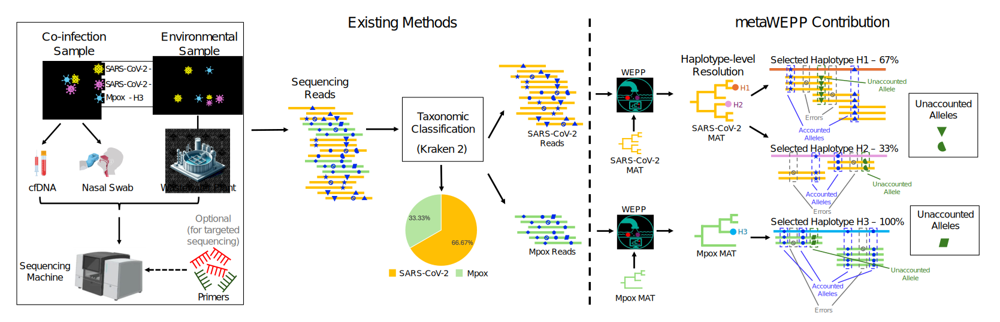

# metaWEPP: Improving the resolution of metagenomic analysis using WEPP

    

## <b>Overview</b>

metaWEPP is a Snakemake-based bioinformatics pipeline that achieves near-haplotype resolution in metagenomic analysis. As illustrated in the figure below, metaWEPP can analyze metagenomic or mixed-genome samples from environmental sources and clinical specimens. metaWEPP first uses standard taxonomic classifiers to assign sequencing reads to known species (any taxonomic level for which a separate MAT has been constructed). It then applies [WEPP](https://github.com/TurakhiaLab/WEPP) to phylogenetically place these reads onto updated, species-specific mutation-annotated trees built from all publicly available clinical sequences, and finally selects the subset of haplotypes that best explains the sample. It also reports unaccounted alleles that are indicative of novel variants and includes an interactive dashboard to provide a detailed read-level visualization for each species.

  

    <b>Figure 1: metaWEPP Overview</b> 

## <b>Key Features</b>

### <b>Species-Level Classification</b>
metaWEPP uses Kraken2 to classify sequencing reads and assign them to pathogen species, producing species-level abundance estimates.

### <b>Haplotype-Level Resolution</b>
For user-specified species, metaWEPP uses [WEPP](https://github.com/TurakhiaLab/WEPP) to perform phylogenetic placement on species-specific mutation-annotated trees (MATs), enabling the identification of haplotypes, estimation of their relative abundances, and detection of unaccounted alleles.

### <b>Unaccounted Alleles</b>
metaWEPP reports *Unaccounted Alleles* for each user-specified species—alleles observed in the sample that are not explained by the selected haplotypes. These alleles may indicate the presence of novel circulating variants.

### <b>Interactive Dashboard</b>
An interactive dashboard enables visualization of the detected haplotypes within the global phylogenetic tree and supports detailed read-level analysis for each species analyzed at the haplotype level.